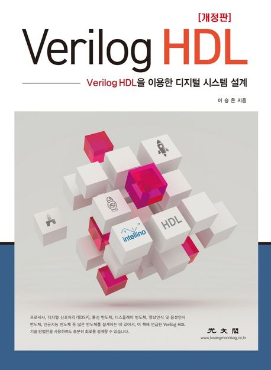

  
<h1 align="center">
  
Verilog HDL을 이용한 디지털 시스템 설계

  
</h1>
  
<b>이승은 저</b> 
광문각 · 2022년 1월 15일 출시</b> 

## :bulb: 목표

- **Verilog HDL 공부한다.**

  > Verilog HDL 기술 방법을 사용한 회로 설계를 공부한다.

 

## :mag: 목차

### Chapter 01. 디지털 시스템(Digital System)

    　1.1 디지털과 아날로그(Digital and Analog)

    　1.2 비트, 바이트, 워드(Bit, Byte, and Word)

    　1.3 수(Numbers)

    　1.4 스위칭 소자(Switching Devices)

    　1.5 논리 게이트(Logic Gates)

    　1.6 논리 레벨(Logic Levels)

    　1.7 CMOS

    　1.8 FPGA와 ASIC

### Chapter 02. 부울 대수(Boolean Algebra)

    　2.1 공리 (Axiom)

    　2.2 정리(Theorem)

    　2.3 드모르간 정리(DeMorgan Theorem)

    　2.4 논리식(Boolean Equation)

    　2.5 카노맵(Karnaugh Map)

### Chapter 03. Verilog HDL

    　3.1 소개(Introduction)

    　3.2 기본 문법(Basics)

    　3.3 연산자(Operators)

    　3.4 모듈 연결(Instantiation)

    　3.5 모델링 레벨(Level of Modeling)

    　3.6 테스트 벤치(Testbench)

    　3.7 시스템 태스크(System Task)

### Chapter 04. 조합회로(Combinational Logic)

    　4.1 게이트(Gates)

    　4.2 모듈(Module)

    　4.3 조합회로 기술 방법(Combinational Logic Design)

    　4.4 데이터 전송 조합회로(Data Logic)

    　4.5 산술연산 조합회로(Arithmetic Logic)

    　4.6 조합회로 테스트 벤치(Testbench)

### Chapter 05. 순차회로(Sequential Logic)

    　5.1 기억소자(Memory)

    　5.2 블로킹과 넌블로킹(Blocking and Non-blocking)

    　5.3 동기식 순차 회로(Synchronous Sequential Logic)

    　5.4 FSM(Finite State Machine)

    　5.5 FMS 기술 방법(FSM Design)

    　5.6 신호등 제어기 FSM(Traffic Signal Controller)

    　5.7 시프트 레지스터(Shift Register)

    　5.8 Verilog HDL 기술방법 요약(Summary)

### Chapter 06. 타이밍(Timing)

    　6.1 조합회로 타이밍(Combinational Logic Timing)

    　6.2 순차회로 타이밍(Sequential Logic Timing)

    　6.3 입출력 형태와 타이밍(Critical Path)

    　6.4 Verilog HDL에서의 딜레이(Delay)

### Chapter 07. IC를 이용한 디지털 시스템 설계 실습(Digital System Design using IC)

    　7.1 실습 전에 알아야 할 것들(Basics)

    　7.2 세그먼트 디코더 설계(Segment Decoder)

    　7.3 2비트 다운 카운터 설계(2-bit Down Counter)

    　7.4 벤딩머신 제어기 설계(Vending Machine)

    　7.5 IC를 이용한 디지털 회로 설계 정리(Summary)

### Chapter 08. Verilog HDL을 이용한 디지털 시스템 설계 실습(Digital System Design using Verilog HDL)

    　8.1 세그먼트 디코더 설계(Segment Decoder)

    　8.2 Verilog HDL 시뮬레이션(Simulation)

    　8.3 FPGA 회로 구현(FPGA Implementation)

    　8.4 세그먼트 디스플레이 컨트롤러 설계(Display Controller)

    　8.5 스톱워치 설계(Stopwatch)

    　8.6 ALU 설계(Arithmetic Logic Unit)

    　8.7 UART 설계(Universal Asynchronous Receiver and Transmitter)

    　8.8 시프트 레지스터(Shift Register)를 이용한 UART 설계

    　8.9 마이크로프로세서 설계(Microprocessor)

### 부록. 실습보드 설명서 (User Manual)

    　1. SPL-Lab100 보드 개요(Overview)

    　2. 입출력(General User Input/Output)