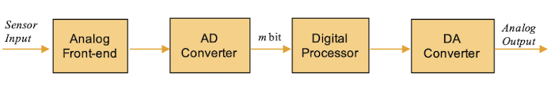
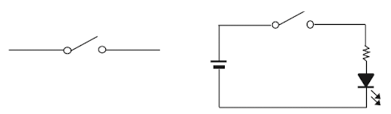
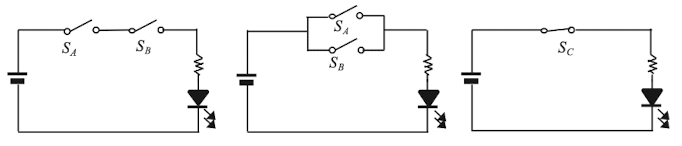
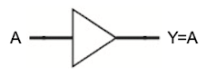
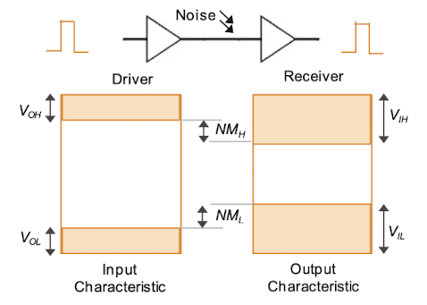
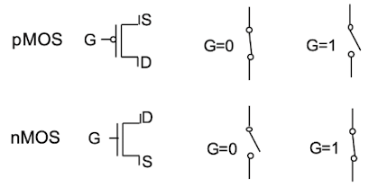
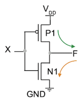
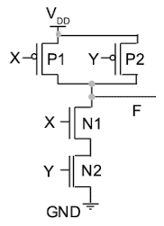

# 1 Digital System

## 1.1 Digital and Analog

다음은 일반적인 전자 시스템 구조도이다.

- Analog Front-end

    Analog Front-end 회로는 외부 센서에서 input으로 받은 analog signal을 증폭 및 필터링하는 등 전처리를 수행한다. 전처리가 수행된 analog signal은 ADC에 의해 digital signal로 변환된다. 

- **ADC**(Analog-to-Digital Converter)

    ADC는 일정 주기(T)마다 analog signal을 **sampling**하여 digital signal로 변환하는 장치다.

- **DAC**(Digital-to-Analog Converter)

    시스템 특성상 analog signal로 변환해서 출력해야 한다면, digital signal을 analog signal로 변환하는 **DAC**를 사용한다.

---

## 1.2 Bit, Byte, and Word

- **bit**

    0과 1의 두 binary digit을 의미한다. 이 bit를 조합하여 표현한 수를 **binary number**(2진수)라고 한다.

    컴퓨터에서는 bit를 이용하여 숫자만이 아니라, character(문자), symbol(기호), instruction(명령) 등을 표시한다.

- **byte**

    "1byte = 8bit"

    > 일반인이 처음 접하게 된 PC가 8bit 시스템이었기 때문에 기본 단위가 되었다. 현재는 16, 32bit를 거쳐 64bit 컴퓨터로 발전하였다.

---

## 1.3 Numbers

> 생략(2진법 변환식, MSB, sign bit, 1's complement, 2's complement)

---

## 1.4 Switching Devices

**switching devices**(스위칭 소자)란 0과 1 값을 표현하면서 그 값을 제어할 수 있는 소자를 의미한다. 요즘은 주로 **CMOS**를 이용해 스위칭 소자를 구현한다.

특히 digital circuit에서 사용하는 스위칭 소자를 **logic gate**라고 한다.

> 순서대로 AND, OR, NOT gate이다.

위 그림의 NOT gate에 input이 주어지면(1) OFF, 주어지지 않으면(0)이면 ON이라고 가정하자. 그러면 OFF(1)일 때 LED가 발광하게 된다. 이처럼 input이 invert(반전)되므로 NOT gate를 **inverter**라고도 부른다.

> NOT gate 두 개를 직렬로 연결하면 입출력이 같아지게 된다.

> NAND gate는 AND gate에 NOT gate를 합친 것과 동일하다. 마찬가지로 NOR gate는 OR gate에 NOT gate를 합친 것과 동일하다.

---

## 1.5 Logit Gates

> 생략(AND, OR, NOT gate의 truth table, NAND, NOR gate의 truth table)

- **buffer**(버퍼)는 input과 output이 같은 logic gate로 다음과 같은 상황에서 사용한다.

    

    - 불안정한 digital signal 파형을 깨끗하게 정형화

    - 큰 output voltage가 필요

    - 회로에 어느 정도의 delay를 추가

---

## 1.6 Logic Levels

앞서 digital system은 0과 1의 bit stream으로 표현한다고 설명했다. 그렇다면 전원 전압이 5V일 때, 3.8V일 때는 논리적으로 같은 1(HIGH)일까? 아니면 0(LOW)일까? 이러한 사양을 정의한 것이 바로 **logic levels**(논리 레벨)이다. 

회로에서는 보통 어느 gate의 output voltage가 다음 gate의 input voltage로 인가(=부하, **load**)되는 구조를 볼 수 있다.

> 이때 다음 gate의 input voltage에 인가되면서 잡음이 중첩될 수 있는데, 이를 방지하기 위해 **noise margin**이라는 개념이 등장한다.

- $V_{OH}$ : HIGH output voltage

- $V_{OL}$ : LOW output voltage

- $V_{IH}$ : HIGH input voltage

- $V_{IL}$ : LOW input voltage

- $NM_{H}$ : HIGH noise margin

- $NM_{L}$ : LOW noise margin

다음 예시들을 보자.

- $V_{IH} = 2V$ 라면, input voltage가 2V 이상일 때 모두 HIGH(1)로 인식한다. 

- $V_{OH} = 2.7V$ 라면, 2.7V 이상의 출력을 모두 HIGH(1)로 출력했음을 알 수 있다.

- 그렇다면 $V_{OL} = 0.5V$ 과 $V_{OH} = 2.7V$ 일 때, 출력으로 2.5V가 나오면 어떻게 생각해야 할까? 정답은 "이 값이 HIGH(1)인지 LOW(0)인지 알 수 없다".

> 컴퓨터 성능을 높이기 위해 CPU의 클럭 속도를 높이는 overclocking(오버클럭킹) 개념과 관련이 있다. 이때 CPU의 클럭 속도가 높아지면서 전원 전압이 높아지는데, 이런 과정에서 noise margin의 여유분을 활용하는 것이다.

참고로 gate가 정상적인 동작을 유지할 수 있는 범위 내에서 최대로 연결할 수 있는 표준 load 수를 **fan-out**(팬아웃)이라고 한다.

---

## 1.7 CMOS

**CMOS**(Complementary metal-oxide-semiconductor)는 p-type MOS transistor와 n-type MOS transistor를 조합하여 만든 스위칭 소자이다. 

> 우리가 사용하는 컴퓨터의 processor는 대부분 CMOS로 구성되어 있다.

transistor는 **gate**(G), **drain**(D), **source**(S)로 구성되어 있다. 

> digital system에서는 단순히 gate의 값에 따라 ON/OFF가 결정되는 스위치로 생각하면 된다.

- nMOS: gate가 1일 때 OFF, 0일 때 ON

- pMOS: gate가 0일 때 ON, 1일 때 OFF

> pMOS gate에 동그라미를 그려서 구분한다.

---

### 1.7.1 CMOS inverter

이제 이 둘을 조합한 CMOS를 살펴보자. 다음은 CMOS로 구현한 inverter 회로 그림이다.

- input X는 pMOS, nMOS gate에 공통으로 인가된다.

- output은 두 transistor의 drain이 연결된 node에서 나온다.

| X | P1 | N1 | F |
| :---: | :---: | :---: | :---: |
| 0 | ON | OFF | 1 |
| 1 | OFF | ON | 0 | 

그림의 출력을 따라가면 출력 커패시터 $C_{o}$ 가 연결되어 있다.

- 외부로 흘러나간(F=1) 전류는 출력 커패시터 $C_{o}$ 을 충전시키게 된다.(HIGH)

- 반대로 흘러가지 않는다면(F=0), 출력 커패시터 $C_{o}$ 의 전하를 방전시킨다.(LOW)

---

### 1.7.2 CMOS NAND gate

다음은 CMOS로 구현한 NAND gate 회로 그림을 살펴보자.

- 2개의 pMOS가 병렬, 2개의 nMOS가 직렬로 연결되어 있으며, drain이 연결된 node가 output이다.

| X | Y | N1 | P1 | N2 | P2 | F |
| :---: | :---: | :---: | :---: | :---: | :---: | :---: |
| 0 | 0 | OFF | ON | OFF | ON | 1 |
| 0 | 1 | OFF | ON | ON | OFF | 1 |
| 1 | 0 | ON | OFF | OFF | ON | 1 |
| 1 | 1 | ON | OFF | ON | OFF | 0 |

---

### 1.7.3 CMOS gate의 특정

CMOS gate는 오직 output이 LOW(0)에서 HIGH(1)으로 변하는 짧은 시간 동안만 출력 커패시터에 충전 전류가 흐르게 된다. 

> 이러한 특성 덕분에 소비전력이 굉장히 적어서 **VLSI**(Very Large Scale Integrated Cricuit)에 적합하다.

출력 커패시터 $C_{o}$ 에 공급되는 에너지는 다음과 같다.

$$C_{o} = QV_{DD} = C{V_{DD}}^{2}$$ 

만약 매초 $f$ 번 스위칭이 일어난다면 CMOS의 dynamic 전력 소비량 $P_{D}$ 은 다음과 같다.

$$ P_{D} = {1 \over 2}C_{o}{V_{DD}}^{2}f $$

이러한 전력 소비량을 낮추기 위해서는 입력 전압 $V_{DD}$ 와 $C_{o}$ 를 줄여야 하는 것이다.

> 동작 주파수를 낮춰도 가능하다.

> 컴퓨터에서는 전력 소모를 줄이기 위해, 환경에 맞춰서 동작 전원과 동작 주파수를 dynamic하게 조절한다. 이런 기술을 **DYFS**(Dynamic Voltage and Frequency Scaling)이라고 한다.

---

## 1.8 FPGA, ASIC

**FPGA**(Field Programmable Gate Array)

- 프로그래밍 가능한 논리 요소로 AND, OR, NAND, XOR, NOT 등의 logic gate를 갖는다.

- 데이터 저장을 위한 블록으로 flip-flop, memory를 내장하고 있다.

> 자이링스의 공동 창립자인 Ross Freeman(로스 프리맨)이 1984년에 발명하였다.

> 전통적으로 FPGA는 주로 '제조 비용이 비싸고 제작에 오래 걸리는 ASIC'을 만들기 전에 회로의 기능을 검증하기 위해 사용하였다.

**ASIC**(Application Specific Integrated Circuit)

- 흔히 칩이라고 불리는, **specific**한 용도를 위해 설계된 집적 회로

집적 기술의 발전은 특정 시스템을 하나의 단일 칩에 제조할 수 있게 만들었다. 단일 칩에 시스템을 구현한 반도체를 **SoC**(System on Chip)이라 한다.

> SoC는 내부에 하나 이상의 processor, 통신, 영상, 음성을 처리하는 디지털 회로 뿐만 아니라, 아날로그 회로도 포함한다.

> 대표적으로 스마트폰에 내장되는 Qualcomm Snapdragon, Apple A-series, Samsung Exynos 등이 있다.

> 스마트 기기에 사용되는 processor는 **AP**(Application Processor)라고도 지칭한다.

잠시 반도체 기업의 분류를 살펴보자.

- 외부 업체가 설계한 ASIC을 위탁받아 생산 및 공급하는 전문 업체를 **Foundry**(fab)라고 한다.

- 반대로 공장 없이 위탁 생산을 맡기며, 반도체의 설계와 판매를 전문으로 하는 기업을 **fabless**라고 한다.

- 설계와 제조를 모두 하는 종합 반도체 기업을 **IDM**(Integrated Device Manufacturer)라고 한다.

---