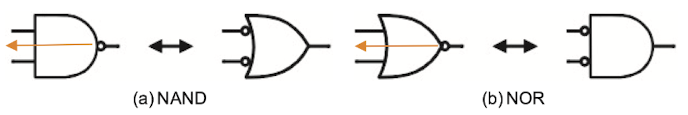
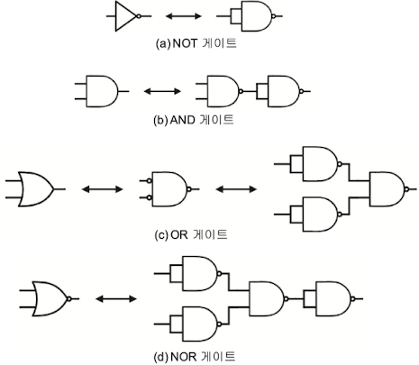
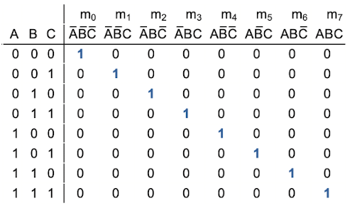
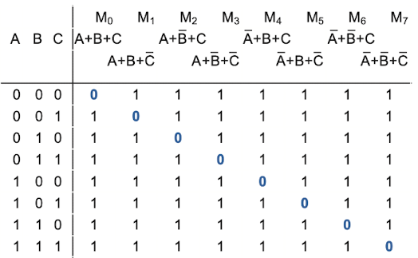

# 2 Boolean Algebra

## 2.1 Axiom

**Boolean Algebra**(부울 대수)도 대수학이나 기하학처럼 일련의 **Axiom**(공리)를 전제로 한다. 여기서 공리란 '어떤 것이 참이라고 가정하는 기본 정의의 최소 집합'을 의미한다.

Boolean Algebra에서는 다음 10가지를 공리, 즉 기본 정의로 한다.

| | Axiom | Dual |
| :---: | :---: | :---: |
| A1 | X $\neq$ 1 이면 X = 0 | X $\neq$ 0 이면 X = 1 |
| A2 | 0 $\cdot$ 0 = 0 | 1 + 1 = 1 |
| A3 | 0 $\cdot$ 1 = 1 $\cdot$ 0 = 0 | 1 + 0 = 0 + 1 = 1 |
| A4 | 1 $\cdot$ 1 = 1 | 0 + 0 = 0 |
| A5 | $\bar{0}$ = 1 | $\bar{1}$ = 0 |

- Axiom에서 0과 1을 반전시키고, $\cdot$ (AND) 와 + (OR)을 반전시키면 서로 같아진다. 이를 **duality**(쌍대성)이라고 한다.

  > 한쪽을 다른 쪽의 dual(쌍대)라고 지칭한다.

- $\bar{ }$ 는 NOT 연산(negation)을 의미한다.

---

## 2.2 Theorem

> 생략: Axiom에서 유도한 Theorem 몇 가지

---

## 2.3 DeMorgan Theorem

**DeMorgan Theorem**(드모르간 정리)는 다음과 같이 해석하면 된다.

- 임의의 logit function의 부정: 모든 변수에 부정을 취하고, 모든 AND와 OR을 반전시킨다.

이러한 DeMorgan Theorem을 이용하면 '모든 gate를 등가적으로 NAND gate만으로' 혹은 'NOR gate만으로' 표현할 수 있다.

- bubble은 NOT gate를 의미한다.

- NAND gate: output의 bubble을 input으로 옮기고, 동시에 AND gate를 OR gate로 반전시킨다.

- NOR gate: output의 bubble을 input으로 옮기고, 동시에 OR gate를 AND gate로 반전시킨다.

> 이렇게 output에 위치한 bubble을 input으로 보내는 특징 때문에, DeMorgan Theorem을 **Bubble Pushing**이라고도 부른다.

> bubble은 두 개가 모이면 터지게 된다.

이러한 성질 때문에 NAND gate와 NOR gate를 functionally complete하다고 말한다. 또한 일반적으로 CMOS의 AND/OR gate는 NAND/NOr gate에 NOT gate를 직렬로 연결해서 설계한다. 이렇게 설계하는 이유는 다음과 같다.

- NAND/NOR gate의 동작 속도가 더 빠르다(delay가 더 짧다.)

- NAND gate는 IC화에 유리하고, bubble pushing을 이용하면 회로 구현에 있어서 IC 패키지 수를 줄일 수 있다.

NAND gate를 이용한 다른 gate 구현을 한 번 살펴보자. 

- (a) NOT gate: 단순히 NAND gate에서 두 개의 input으로 받으면 구현할 수 있다.

- (b) AND gate: NAND gate + NOT gate로 구현할 수 있다.

- (c) OR gate: DeMorgan Theorem을 이용한 뒤, (a)의 NOT gate로 구현할 수 있다.

- (d) NOR gate: DeMoragn Theorem을 이용한 뒤, (a)의 NOT gate와 (b)의 AND gate로 구현할 수 있다.

---

## 2.4 Boolean Equation

logic gate에서 input, output 관계를 표현하는 가장 확실하게 표현하려면, truth table을 만들어서 모든 input 조합에 해당되는 output을 truth table로 정의하면 된다.

이러한 **boolean equation**(논리식) 중에서도 **standard**에 해당되는 두 가지 형식이 있다.

- **SOP**: Sum of Product

  > `F = AB + BC`와 같이 곱이 합해진 형태

- **POS**: Product of Sum

  > `F = (A+B)*(B+C)`와 같이 합이 곱해진 형태

---

### 2.4.1 SOP(Sum of Product)

몇 개의 변수에서 '모든 변수와 변수의 부정을 한 번씩 포함'하는 논리곱을 만든다. 이를 **minterm**(최소항)이라고 한다.

> 예를 들어 두 변수 `A, B` 가 있다면, minterm은 `AB, A'B, AB', A'B'`이다.

`A, B, C` 세 변수가 있을 때 minterm을 한 번 살펴보자.

- 가능한 input 조합은 왼쪽 8개 항이다.

- $m_{0} ~ m_{7}$ : 각 항의 minterm을 의미한다.

여기서 대각선 방향으로 1이 되는 특징에 주목하자. 예시를 더 보자.

- $m_{0}(A'B'C')$ : A,B,C가 000인 경우만 1이 된다.

- $m_{3}(A'BC)$ : A,B,C가 011인 경우만 1이 된다.

즉, boolean equation이 있다면, output이 1인 minterm의 합만으로 표현할 수 있다.

---

### 2.4.2 POS(Product of Sum)

몇 개의 변수에서 '모든 변수와 변수의 부정을 한 번씩 포함'하는 논리합을 만든다. 이를 **maxterm**(최대항)이라고 한다.

> 예를 들어 두 변수 `A, B` 가 있다면, maxterm은 `A + B, A' + B, A + B', A' + B'`이다.

`A, B, C` 세 변수가 있을 때 maxterm을 한 번 살펴보자.

- 가능한 input 조합은 왼쪽 8개 항이다.

- $M_{0} ~ M_{7}$ : 각 항의 maxterm을 의미한다.

여기서 대각선 방향으로 0이 되는 특징에 주목하자. 예시를 더 보자.

- $M_{0}(A+B+C)$ : A,B,C가 000인 경우만 0이 된다.

- $M_{3}(A+B'+C')$ : A,B,C가 011인 경우만 0이 된다.

즉, boolean equation이 있다면, output이 0인 maxterm의 곱만으로 표현할 수 있다.

---

